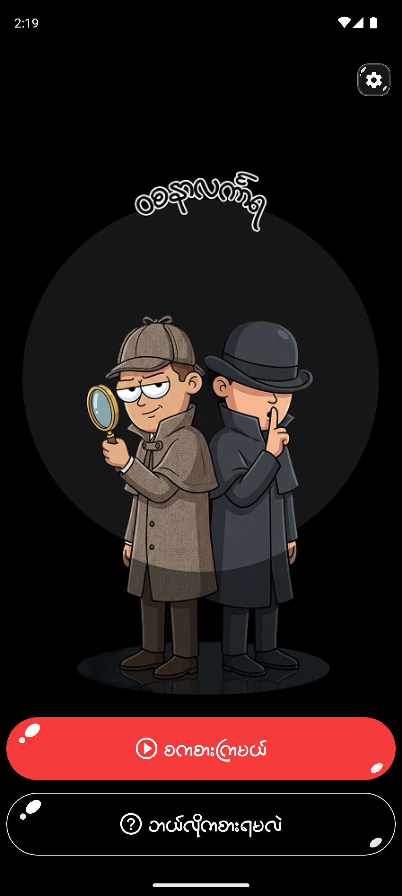
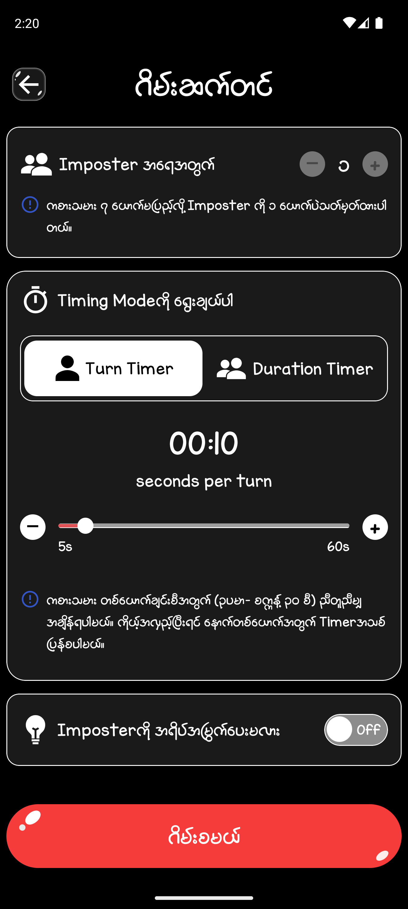
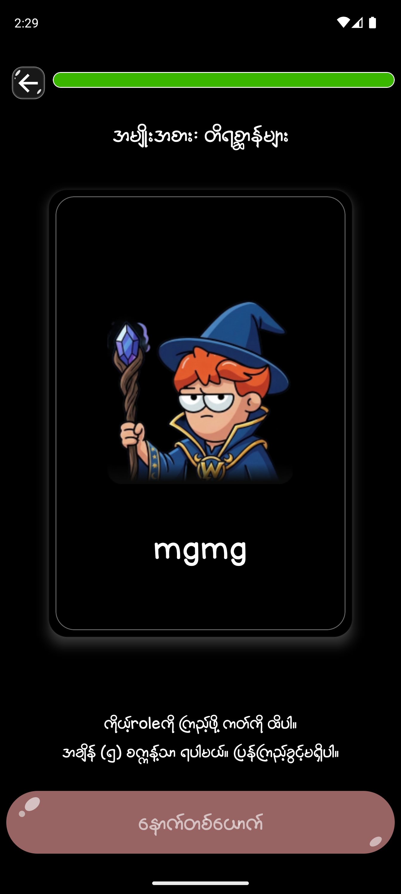
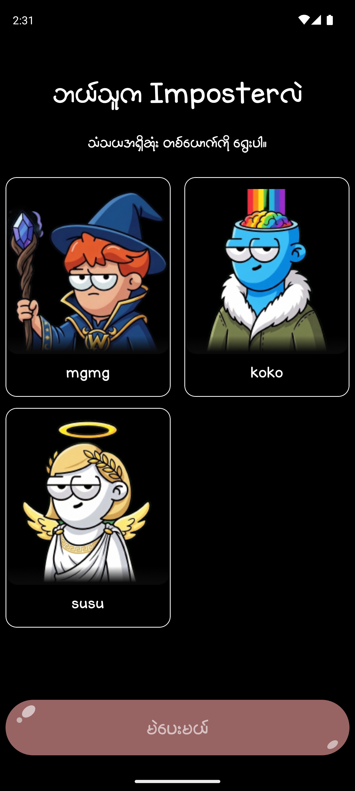

# Wazanerlingara (mobile version)

Wazanerlingara is a party game mobile app built with Expo and React Native. It is designed for **group play** around hidden roles, secret words, and voting rounds where players try to identify the imposter.

The app uses Expo Router for navigation, NativeWind for styling, local game data for categories and prompts, and audio support to make the gameplay feel more interactive.

## Features

- **Burmese-first** UI copy across the game experience
- Onboarding flow for first-time players
- Two game modes: word-based and question-based play
- Category selection for different themes such as animals, food, places, movies, sports, and more
- Role reveal screens for teammates and imposters
- Voting flow with transition and result screens
- Settings for background music, sound, privacy, and contact

## Screenshots

<div align="center">
<table>
   <tr>
      <td></td>
      <td></td>
   </tr>
   <tr>
      <td></td>
      <td></td>
   </tr>
</table>
</div>

_More features are included in projects_

## Requirements

- Node.js
- npm
- Expo Go, an Android emulator, an iOS simulator, or a development build

## Getting Started

1. Install dependencies

   ```bash
   npm install
   ```

2. Start the development server

   ```bash
   npm start
   ```

3. Open the app on your preferred platform

   ```bash
   npm run android
   npm run ios
   npm run web
   ```

If you want to launch directly from Expo CLI, you can also use:

```bash
npx expo start
```

## Available Scripts

- `npm start` - start the Expo development server
- `npm run android` - open the app on Android
- `npm run ios` - open the app on iOS
- `npm run web` - run the app in a browser
- `npm run lint` - run the Expo lint rules
- `npm run reset-project` - reset the starter scaffold if needed

## Project Structure

- `app/` - Expo Router screens and route flow
- `components/` - shared UI and layout components
- `features/` - feature-specific logic and reusable game UI
- `constants/` - app configuration, themes, and bundled game data
- `hooks/` - shared React hooks
- `lib/` - helper utilities
- `assets/` - images, fonts, audio, and SVG assets
- `data-collection.json` - bundled word & question data

## Tech Stack

- Expo SDK 54
- React Native 0.81
- Expo Router
- TypeScript
- NativeWind and Tailwind CSS
- React Hook Form and Zod
- Expo Audio, Haptics, Asset, Font, and Image modules

## Notes

- The app is configured for portrait orientation.
- Android uses the package name `com.thurein_htet99.wazanerlingara`.
- The app includes permissions for audio settings to support gameplay features.
